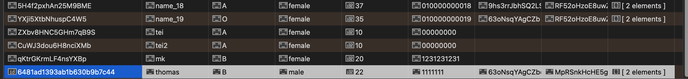

# GraphQL 완전정복 참고 자료
https://freeseamew.gitbook.io/graphql/

<br>

# 1. 실습자료 & 코드 다운로드 경로
- GraphQL 실습 자료(graphQL기본&고급 섹션 실습용) \
   https://github.com/freeseamew/graphql-study-apollo-v3 \
- 디자인 요소 \
   https://github.com/freeseamew/smart-menu-design \
- Smart Menu 프로젝트:\
   https://github.com/freeseamew/smart-menu-study

<br>​

# 2. 각 섹션 필수 링크 및 설치 패키지
## 섹션1
### 섹션 1-1. API 소개 및 REST API 소개
   - 영화 API: https://www.themoviedb.org
   ### 섹션 1-2. GraphQL 소개
   - GraphQL 공식 사이트: https://graphql-kr.github.io/

<br>

## 섹션2

   ### 섹션2-1. 실습환경 구축

   -  meteor(미티어) 설치
      ```bash
      npm install -g meteor
      ```
   - GraphQL 실습 자료 clone
      ```bash
      # https://github.com/freeseamew/graphql-study-apollo-v3
      git clone git@github.com:freeseamew/graphql-study-apollo-v3.git
      ```
   - 패키지 설치
      ```bash
      npm i
      ```
   - 실행
      ```bash
      DISABLE_WEBSOCKETS=true meteor run
      ```
   - 실습 화면(GraphQL 플레이그라운드 ) 접속 \
   | http://localhost:3000/graphql

<br>

## 섹션 3

   ### 섹션3-1. apollo-server 기본구조
   - apollo-server 실습 세팅 \
   graphql-study-apollo-v3/imports/startUp/index.js
      ```js
      import './fixtures';
      // import './apollo-server';
      import './apollo-server-basic';
      ```

   ### 섹션3-2. MongoDB 기본
   - Studio 3T: https://studio3t.com
   - _id 값 차이 \
   몽고디비 툴에서 직접 insert 시 id로 오브젝트 id가 들어가고, \
   meteor 등에서 입력 시에는 스트링으로 들어간다.
   
   - CRUD
      ```bash
      # DB 컬랙션 선택
      db = db.getSiblingDB("meteor");

      # find
      db.getCollection("ex_1_human").find({"blood": {$in :["B", "A"]}, "gender": "female"}).limit(5).skip(10);

      # insert
      db.getCollection("ex_1_human").insert(
         {
            "humanName" : "thomas",
            "blood" : "B",
            "gender" : "male",
            "age" : NumberInt(33),s
            "phone" : "01000000000",
            "belongToId" : "63oNsqYAgCZbds7tR",
            "schoolId" : "MpRSnkHcHE5g9emsJ",
            "hobbyIds" : [
               "qCTHFBoaqegP2HWoS",
               "dwZLk4XiLLBoraz9c"
            ]
         }
      );

      # update
      db.getCollection("ex_1_human").update({"humanName" : "thomas"}, {
         $set: {"age": 22, "phone": "1111111"}
      });

      # delete - meteor 등에서 만들어진 도큐먼트 
      db.getCollection("ex_1_human").deleteOne({"_id": "CuWJ3dou6H8nciXMb"});

      # delete  몽고디비툴에서 직접 insert한 도큐먼트
      db.getCollection("ex_1_human").deleteOne({"_id": ObjectId("6481ad1393ab1b630b9b7c44")});
      db.getCollection("ex_1_human").remove({"_id": ObjectId("6481b3f593ab1b630b9b7c46") });
      db.getCollection("ex_1_human").remove(ObjectId("6481b6f58dfe91e96ed0c21e")); # 에러
      db.getCollection("ex_1_human").deleteOne(ObjectId("6481b6f58dfe91e96ed0c21e")); # 에러
      db.getCollection("ex_1_human").deleteOne({"_id": "6481b6f58dfe91e96ed0c21e"}); # 에러 ?? 삭제도 안 됨
      ```

   ### 섹션4-4,5 Nova를 이용한 성능 개선
   - nova: https://www.bluelibs.com/docs/package-nova/

<br>

## 섹션5. 개발 환경 설정

   ### 섹션5-1. meteor 소개 및 설치
   - nodejs: nodejs.org/ko/
   - 미티어 설치
      ```bash
      npm install -g meteor
      ```
   - 미티어 프로젝트 생성
      ```bash
      meteor create ./ --bare
      ```
   - 패키지 설치
      ```bash 
      npm i       ​  
      ```

   ### 섹션5-2. apollo 소개 및 설치
   - apollo 공식 사이트: https://www.apollographql.com

   - 필수 패키지 목록
      ```bash
      meteor add apollo
      meteor add swydo:graphql
      ​
      meteor npm i -s apollo-server
      meteor npm i -s apollo-server-express
      meteor npm i -s graphql
      ```
   ### 섹션 5-3. 비주얼 스튜디오 코드 설치
   - 공식 사이트 : https://code.visualstudio.com/

<br>

## 섹션6. Backend 1

### 섹션 6-10.subscription - order
   - 설치 패키지
      ```bash
      meteor npm i graphql-subscriptions 
      # 또는 
      yarn add graphql-subscriptions 
      meteor npm i graphql
      meteor npm i subscriptions-transport-ws
      ```   
섹션7. Backend2
섹션7-1. 인증과정 설명
설치 패키지
meteor add accounts-password
섹션8. frontend 1
섹션8-1. svelte 기본
svelte 공식 사이트: svelte.dev
svelte REPL 실습 링크: svelte.dev/repl/hello-world
섹션8-3. 필수 모듈 설치 및 폴더구조
설치 패키지
meteor add zodern:melte
​
meteor npm i @apollo/client;
meteor npm i -s svelte
meteor npm i -s svelte-apollo
meteor npm i -s tinro 
​
meteor add fourseven:scss // scss 사용 : import '경로/이름.scss'으로 사용가능
meteor add hot-module-replacement
섹션8-6. 디자인요소 배치
디자인파일 다운: https://github.com/freeseamew/smart-menu-design
섹션12
섹션12-1. 파일 업로드 api 서버 구현
설치 패키지
npm install graphql-upload 
​
meteor npm i short
meteor npm i fs-extra
섹션12-2. frontend 업로드 구현
설치 패키지
meteor npm i apollo-upload-client
섹션 14.
섹션 14-3 주문 관련 캐싱 설정
설치 패키
meteor npm i shortid 
섹션 15.
섹션 15-1. 폼검증
설치 패키
meteor npm i yup 
yup 공식 사이트: https://github.com/jquense/yup
15-2. notyf를 이용한 알람 및 효과
notyf 공식 사이트: carlosroso.com/notyf/
패키지 설치
meteor npm i notyf
섹션16
섹션16-1. env(환경변수) 설정
패키지 설치
meteor npm i dotenv
섹션 16-2. 배포
프로젝트 git 참조: https://github.com/freeseamew/smart-menu-study